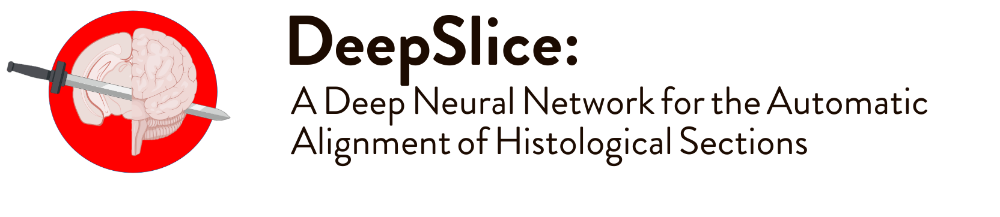
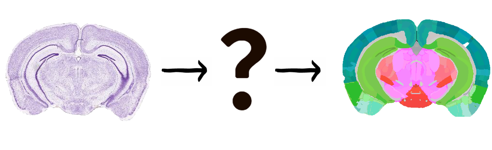

DeepSlice is a python library which automatically aligns mouse histology with the allen brain atlas common coordinate framework.
The alignments are viewable, and refinable, using the [QuickNII](https://www.nitrc.org/projects/quicknii "QuickNII") software package.
DeepSlice requires no preprocessing and works on any stain, however we have found it performs best on brightfield images.
At present one limitation is that it only works on Coronally cut sections, we will release an update in the future for sagittal and horizontally cut histology.
 
DeepSlice automates the process of identifying exactly where in the brain a section lies, it can accomodate non-orthogonal cutting planes and will produce an image specific annotation for each section in your brain.  

## Workflow 
DeepSlice is fully integrated with the <a href="https://quint-workflow.readthedocs.io/en/latest/QUINTintro.html" >QUINT workflow.</a>  Quint helps you register, segment and quantify brain wide datasets! &nbsp; 🐭🧠🔬💻🤖

## Web Application
If you would like to use DeepSlice but don't need your own personal installation, check out [**DeepSlice Flask**](https://www.DeepSlice.com.au), a fully functional web application which will allow you to upload your dataset and download the aligned results. The web interface was developed by [Michael Pegios](https://github.com/ThermoDev/).
## [Installation: How to install DeepSlice](#installation)

## [Usage: How to align using DeepSlice](#basic-usage)
## [For a jupyter notebook example check out](examples/example_notebooks/DeepSlice_example.ipynb)

**Happy Aligning :)**


<br>


<a name='Installation'></a> 
<h1> Installation </h1>
<!-- This h2 must be bold  -->

<h2 style="font-weight: bold; text-decoration: underline"> From PIP  </h2>
This is the easy and recommended way to install DeepSlice. Make sure your env has Python 3.7 installed and then simply:

```bash
pip install DeepSlice
```
And you're ready to go! 🚀 Check out the PyPi package [here](https://pypi.org/project/DeepSlice/)

<h2 style="font-weight: bold; text-decoration: underline"> From Source </h2>

**First** To use DeepSlice you must have python3.7 installed. In order to easily install all the dependancies we recommend using [Anaconda](https://www.anaconda.com/products/individual "Anaconda Installation Files"). 


**Second** Once anaconda is installed, cd into your cloned DeepSlice directory, then cd into the 'conda_environments' directory, and use our premade environment files to setup your system. 
```
cd DeepSlice/conda_environments
```
* **CPU Installation** For most users we recommend using the DS-CPU.yaml installation file. this will install all the dependencies required to run DeepSlice on your CPU. 
Do this with the command: 

      conda env create -f DS-CPU.yml


* **GPU Installation** If you wish to run DeepSlice on a huge number of images, and have access to an nvidia GPU then please use the DS-GPU.yaml installation file.

      conda env create -f DS-GPU.yml

**Finished :)** You are now ready to run DeepSlice. Just activate the environment using 
```python
conda activate DS-CPU
```
or 
```python 
conda activate DS-GPU
```
If you run into any problems create a github issue and I will help you solve it.

<br>

<a name='BasicUsage'></a>    
# Basic Usage                                                                                                         
## On start                                                                                                                         
After cloning our repo and navigating into the directory open an ipython session and import our package.                 
```python                                                                                                                
from DeepSlice import DSModel     
```                                                                                                                      
Next, specify the species you would like to use and initiate the model.                                                                    
```python                                                                                                                
species = 'mouse' #available species are 'mouse' and 'rat'

Model = DSModel(species)
```                                                                             

---
**Important**

* Sections in a folder must all be from the same brain

* DeepSlice uses all the sections you select to inform its prediction of section angle. Thus it is important that you do not include sections which lie outside of the Allen Brain Atlas. This include extremely rostral olfactory bulb and caudal medulla. **If you include these sections in your selected folder it will reduce the quality of all the predictions**.

* The sections do not need to be in any kind of order. 

* The model downsamples images to 299x299, you do not need to worry about this but be aware that there is no benefit from using higher resolutions.

------

## Predictions

Now your model is ready to use, just direct it towards the folder containing the images you would like to align.            
<br/> eg:                                                                                                                
```bash                                                                                                              
    
 ├── your_brain_folder
 │   ├── brain_slice_1.png 
 │   ├── brain_slice_2.png     
 │   ├── brain_slice_3.png
```                                                                                                                      
In this parent directory there should be only one sub folder, in this example this is "your_brain_folder".               
<br />To align these images using DeepSlice simply call                                                                  
```python                                                                                                                
folderpath = 'examples/example_brain/GLTa/'
#here you run the model on your folder
#try with and without ensemble to find the model which best works for you
#if you have section numbers included in the filename as _sXXX specify this :)
Model.predict(folderpath, ensemble=True, section_numbers=True)    
#If you would like to normalise the angles (you should)
Model.propagate_angles()                     
#To reorder your sections according to the section numbers 
Model.enforce_index_order()    
#alternatively if you know the precise spacing (ie; 1, 2, 4, indicates that section 3 has been left out of the series) Then you can use      
#Furthermore if you know the exact section thickness in microns this can be included instead of None        
Model.enforce_index_spacing(section_thickness = None)
#now we save which will produce a json file which can be placed in the same directory as your images and then opened with QuickNII. 
Model.save_predictions(folderpath + 'MyResults')                                                                                                             


```


