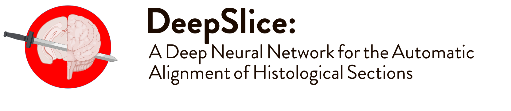
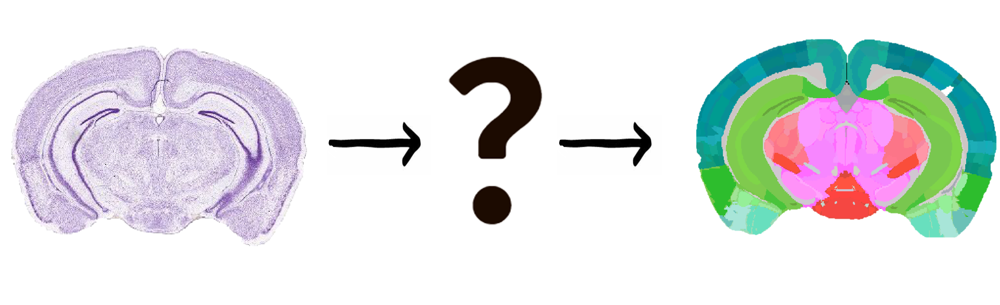

DeepSlice is a python library, published by [the McMullan Lab Group](https://researchers.mq.edu.au/en/persons/simon-mcmullan), which automatically aligns mouse histology with the allen brain atlas common coordinate framework.
It is the Masters project of [Harry Carey](https://github.com/PolarBean/). The alignments are viewable, and refinable, using the [QuickNII](https://www.nitrc.org/projects/quicknii "QuickNII") software package.
DeepSlice requires no preprocessing and works on any stain, however we have found it performs best on brightfield images.
At present one limitation is that it only works on Coronally cut sections, we will release an update in the future for sagittal and horizontally cut histology.
 
DeepSlice automates the process of identifying exactly where in the brain a section lies, it can accomodate non-orthogonal cutting planes and will produce an image specific annotation for each section in your brain.   
## Web Application
If you would like to use DeepSlice but don't need your own personal installation, check out [**DeepSlice Flask**](https://www.DeepSlice.com.au), a fully functional web application which will allow you to upload your dataset and download the aligned results. The web interface was developed by [Michael Pegios](https://github.com/ThermoDev/).
## [Installation: How to install DeepSlice](docs/installation.md)

## [Usage: How to align using DeepSlice](docs/usage.md)
For a quick example using google colab, view our notebook here! 

**Happy Aligning :)**

